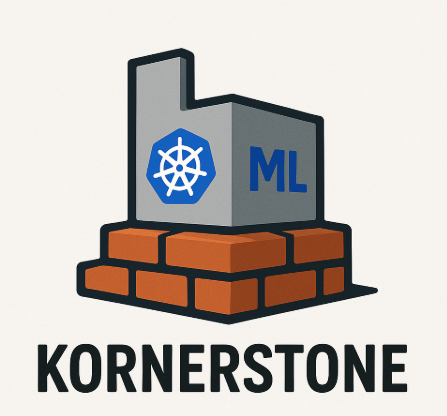
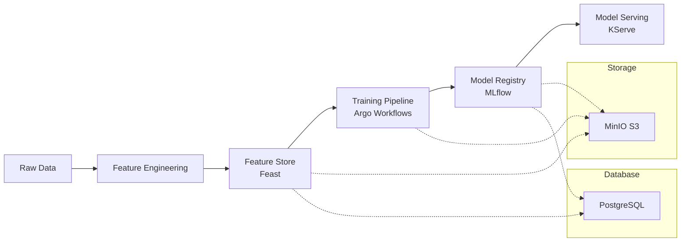

# Kornerstone




This repository contains the implementation of a Kubernetes-native machine learning platform using:
- Argo Workflows for ML pipeline orchestration
- Feast for feature store and management
- MinIO for object storage
- MLflow for experiment tracking and model registry
- KServe for model serving

## Prerequisites
- Kubernetes cluster
- kubectl
- kustomize (included in recent kubectl versions)
- Feast CLI (for feature management)

## Architecture
The platform integrates the following components:
- Feature Store (Feast)
  - Uses PostgreSQL for registry and online store
  - Uses MinIO (S3) for offline storage
- ML Pipeline (Argo Workflows)
- Experiment Tracking (MLflow)
- Model Serving (KServe)

### ML Lifecycle Flow


## Quick Start

1. Install KServe CRDs and controller:
```bash
kubectl apply -k kornerstone/deploy/base/kserve/install
```

2. Wait for KServe controller to be ready:
```bash
kubectl wait --for=condition=ready pod -l control-plane=kserve-controller-manager -n kserve --timeout=300s
```

3. Deploy all components:
```bash
kubectl apply -k kornerstone
```

4. Apply feature definitions:
```bash
cd ml/feature_repo
feast apply
```

5. Run a training workflow:
```bash
kubectl create -f workflows/training-workflow.yaml
```

## Component Details

### Feature Store (Feast)
- Registry and online store: PostgreSQL
- Offline store: MinIO (S3-compatible)
- Feature server endpoint: feast-feature-server:6566

### MLflow
- Tracking server endpoint: mlflow-server:5000
- Artifact storage: MinIO
- Backend database: PostgreSQL

### MinIO
- API endpoint: minio:9000
- Console: minio:9001

### PostgreSQL
- Endpoint: postgres:5432
- Databases:
  - mlflow: MLflow metadata
  - feast: Feast registry and online store

## Development

### Adding New Features
1. Define features in `ml/feature_repo/feature_definitions/`
2. Apply changes using Feast CLI
3. Update training code to use new features

### Training Models
1. Ensure features are registered in Feast
2. Update training workflow as needed
3. Submit workflow to Argo

## Monitoring
- MLflow UI: Track experiments and model versions
- Feast UI: Monitor feature statistics and metadata
- MinIO Console: Monitor storage usage
- Argo UI: Monitor workflow execution