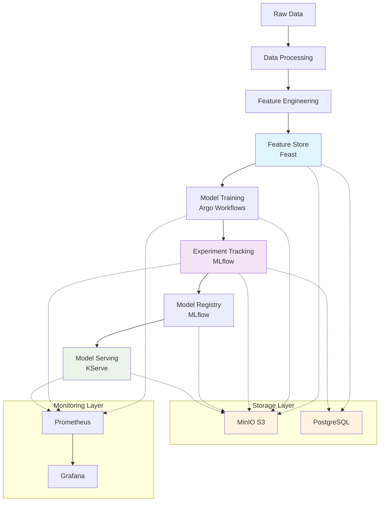

# Kornerstone


**Kornerstone** is a comprehensive, Kubernetes-native machine learning platform that provides all the essential tools for the complete ML lifecycle. Built with enterprise-grade components and designed for scalability, Kornerstone enables teams to quickly deploy a production-ready ML infrastructure.

## 🚀 Features

- **Complete ML Lifecycle**: From data preparation to model serving
- **Kubernetes Native**: Cloud-native architecture with auto-scaling capabilities
- **Production Ready**: Enterprise-grade components with monitoring and observability
- **Easy Deployment**: One-command installation with Helm
- **Open Source**: Built on proven open-source technologies

## 🏗️ Architecture

Kornerstone integrates the following best-in-class components:

### Core Components

| Component | Purpose | Technology |
|-----------|---------|------------|
| **Feature Store** | Feature management and serving | [Feast](https://feast.dev/) |
| **Experiment Tracking** | ML experiment management and model registry | [MLflow](https://mlflow.org/) |
| **Workflow Orchestration** | ML pipeline automation | [Argo Workflows](https://argoproj.github.io/argo-workflows/) |
| **Model Serving** | Production model deployment | [KServe](https://kserve.github.io/website/) |
| **Object Storage** | Artifact and data storage | [MinIO](https://min.io/) |
| **Database** | Metadata and feature storage | [PostgreSQL](https://www.postgresql.org/) |

### Supporting Infrastructure

| Component | Purpose | Technology |
|-----------|---------|------------|
| **Monitoring** (Optional) | Platform observability | Prometheus + Grafana |
| **Service Discovery** | Internal service communication | Kubernetes Services |
| **Secret Management** | Credential and configuration management | Kubernetes Secrets |
| **Storage** | Persistent data storage | Kubernetes PVC |

## 🎯 ML Lifecycle Flow



## 📋 Prerequisites

- **Kubernetes cluster** (v1.19+) - Local (minikube, kind) or cloud (EKS, GKE, AKS)
- **Helm** (v3.0+) - Package manager for Kubernetes
- **kubectl** - Kubernetes command-line tool
- **Storage class** - For persistent volumes (default: `standard`)

### Optional Prerequisites

- **KServe CRDs** - Install KServe in the cluster if you plan to deploy models
  - Docs: https://kserve.github.io/website/
- **cert-manager** - For KServe TLS certificates if you expose externally
- **Ingress controller** - For external access (NGINX, Traefik, etc.)

## 🚀 Quick Start

### 1. Clone the Repository

```bash
git clone https://github.com/yourusername/kornerstone.git
cd kornerstone
```

### 2. Deploy the Platform

Use the automated deployment script:

```bash
./deploy.sh
```

Or manually deploy with Helm:

```bash
# Add required repositories
helm repo add bitnami https://charts.bitnami.com/bitnami
helm repo add argo https://argoproj.github.io/argo-helm
helm repo add prometheus-community https://prometheus-community.github.io/helm-charts
helm repo update

# Install Kornerstone (namespace: kornerstone-ml)
helm dependency update ./helm/kornerstone
helm install kornerstone ./helm/kornerstone --namespace kornerstone-ml --create-namespace
```

### 3. Access the Services

Set up port forwarding to access the UI components:

```bash
# MLflow UI (Experiment Tracking)
kubectl port-forward svc/kornerstone-mlflow 5000:5000 -n kornerstone-ml

# MinIO Console (Object Storage)
kubectl port-forward svc/kornerstone-minio 9001:9001 -n kornerstone-ml

# Argo Workflows UI (Pipeline Orchestration)
kubectl port-forward svc/kornerstone-argo-workflows-server 2746:2746 -n kornerstone-ml

# Feast Feature Server API
kubectl port-forward svc/kornerstone-feast 6566:6566 -n kornerstone-ml
```

Access the services in your browser:
- **MLflow**: http://localhost:5000
- **MinIO Console**: http://localhost:9001 (Username: `minio`, Password: `minio123`)
- **Argo Workflows**: http://localhost:2746
 - **Feast API**: http://localhost:6566

## 🔧 Configuration

### Component Configuration

Each component can be enabled/disabled and configured independently:

```yaml
# values.yaml
mlflow:
  enabled: true
  service:
    type: ClusterIP
    port: 5000

feast:
  enabled: true
  image:
    tag: "0.34.1"

argo:
  enabled: true
  server:
    service:
      type: ClusterIP

kserve:
  enabled: true
  # Install KServe separately in the cluster if not present

minio:
  enabled: true
  auth:
    rootUser: minio
    rootPassword: minio123

postgresql:
  enabled: true
  auth:
    username: feast
    password: feast123
    database: feast

monitoring:
  enabled: false  # Set to true for Prometheus/Grafana
```

### Storage Configuration

```yaml
global:
  namespace: kornerstone-ml
  storageClass: standard  # Use your cluster's storage class
  
minio:
  persistence:
    size: 20Gi
    
postgresql:
  primary:
    persistence:
      size: 10Gi
```

### Advanced Deployment Options

```bash
# Deploy with custom values
helm install kornerstone ./helm/kornerstone -f custom-values.yaml

# Deploy with specific components
./deploy.sh --namespace my-namespace --release-name my-kornerstone

# Clean install (removes existing KServe resources)
./deploy.sh --clean-kserve

# Rebuild dependencies
./deploy.sh --rebuild-deps
```

## 📊 Usage Examples

### End-to-end: Iris RandomForest with Argo + KServe

Files:
- `examples/iris/train_iris.py`: trains RF on iris, logs to MLflow, uploads model to MinIO
- `examples/iris/kserve_inferenceservice.yaml`: KServe InferenceService pointing at `s3://mlflow/models/iris-rf`
- `examples/iris/workflow_iris.py`: Hera workflow to run training then apply the KServe manifest

Run:
```bash
python examples/iris/workflow_iris.py --namespace kornerstone-ml --submit
kubectl get inferenceservices.serving.kserve.io -n kornerstone-ml
```

### 1. Feature Store (Feast)

```python
from feast import FeatureStore

# Initialize feature store
fs = FeatureStore(repo_path=".")

# Get features for training
features = fs.get_historical_features(
    entity_df=entity_df,
    features=["user_features:age", "item_features:category"]
).to_df()

# Get features for serving
features = fs.get_online_features(
    features=["user_features:age", "item_features:category"],
    entity_rows=[{"user_id": 1001, "item_id": 2002}]
).to_dict()
```

### 2. Experiment Tracking (MLflow)

```python
import mlflow
import mlflow.sklearn

# Set tracking URI
mlflow.set_tracking_uri("http://localhost:5000")

# Start experiment
with mlflow.start_run():
    mlflow.log_param("n_estimators", 100)
    mlflow.log_metric("accuracy", 0.95)
    mlflow.sklearn.log_model(model, "model")
```

### 3. Workflow Orchestration (Argo)

```yaml
# training-workflow.yaml
apiVersion: argoproj.io/v1alpha1
kind: Workflow
metadata:
  generateName: ml-training-
spec:
  entrypoint: ml-pipeline
  templates:
  - name: ml-pipeline
    steps:
    - - name: data-prep
        template: data-processing
    - - name: train-model
        template: model-training
    - - name: register-model
        template: model-registration
```

### 4. Model Serving (KServe)

```yaml
# model-serving.yaml
apiVersion: serving.kserve.io/v1beta1
kind: InferenceService
metadata:
  name: sklearn-iris
spec:
  predictor:
    sklearn:
      storageUri: "s3://mlflow/models/iris-model"
```

## 🔍 Monitoring and Observability

### Health Checks

```bash
# Check all components
kubectl get pods -n kornerstone-ml

# Check specific services
kubectl get svc -n kornerstone-ml

# View logs
kubectl logs -f deployment/kornerstone-mlflow -n kornerstone-ml
```

### Metrics and Monitoring

When monitoring is enabled, access Grafana dashboard:

```bash
kubectl port-forward svc/kornerstone-grafana 3000:3000 -n kornerstone-ml
```

Default credentials: `admin` / `admin-password`

## 🛠️ Development

### Adding New Features

1. **Define features** in `ml/feature_repo/feature_definitions/`
2. **Apply changes** using Feast CLI
3. **Create workflows** in `workflows/`
4. **Update models** and register in MLflow

### Custom Docker Images

```bash
# Build custom MLflow image
docker build -t custom-mlflow:latest -f docker/mlflow/Dockerfile .

# Build custom Feast image
docker build -t custom-feast:latest -f docker/feast/Dockerfile .
```

### Testing

```bash
# Run Helm tests
helm test kornerstone -n kornerstone-ml

# Run connectivity tests
kubectl apply -f helm/kornerstone/templates/connectivity-test.yaml
```

## 🔧 Troubleshooting

### Common Issues

1. **Storage Class Issues**
   ```bash
   # Check available storage classes
   kubectl get storageclass
   
   # Update values.yaml with correct storage class
   global:
     storageClass: your-storage-class
   ```

2. **KServe Certificate Issues**
   ```bash
   # Install cert-manager
   kubectl apply -f https://github.com/cert-manager/cert-manager/releases/download/v1.11.0/cert-manager.yaml
   
   # Or use clean installation
   ./deploy.sh --clean-kserve
   ```

3. **Resource Conflicts**
   ```bash
   # Clean install
   helm uninstall kornerstone -n kornerstone-ml
   kubectl delete namespace kornerstone-ml
   ./deploy.sh
   ```

### Debug Mode

```bash
# Deploy with debug output
helm install kornerstone ./helm/kornerstone --debug --dry-run

# Check Helm status
helm status kornerstone -n kornerstone-ml
```

## 🤝 Contributing

1. Fork the repository
2. Create your feature branch (`git checkout -b feature/amazing-feature`)
3. Commit your changes (`git commit -m 'Add amazing feature'`)
4. Push to the branch (`git push origin feature/amazing-feature`)
5. Open a Pull Request

## 📄 License

This project is licensed under the MIT License - see the [LICENSE](LICENSE) file for details.

## 🙏 Acknowledgments

- [Feast](https://feast.dev/) for feature store capabilities
- [MLflow](https://mlflow.org/) for experiment tracking
- [Argo Workflows](https://argoproj.github.io/argo-workflows/) for workflow orchestration
- [KServe](https://kserve.github.io/website/) for model serving
- [MinIO](https://min.io/) for S3-compatible storage
- [PostgreSQL](https://www.postgresql.org/) for database services

## 📞 Support

- 📧 Email: support@kornerstone.io
- 💬 Slack: [Join our community](https://slack.kornerstone.io)
- 🐛 Issues: [GitHub Issues](https://github.com/zaterka/kornerstone/issues)
- 📖 Documentation: [Full Documentation](https://docs.kornerstone.io)